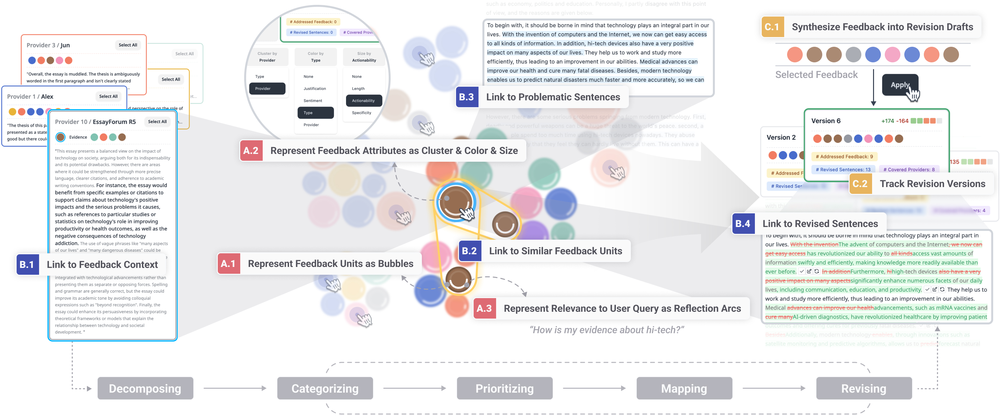

Synthia: Visually Interpreting and Synthesizing Feedback for Writing Revision

[**Link to UIST 2025 Paper**](https://doi.org/10.1145/3746059.3747703)

While recent advances in HCI and generative AI have improved authors' access to feedback on their work, the abundance of critiques can overwhelm writers and obscure actionable insights. We introduce Synthia, a system that visually scaffolds feedback-based writing revision with LLM-powered synthesis. Synthia helps authors strategize their revisions by breaking down large feedback collections into interactive visual bubbles that can be clustered, colored, and resized to reveal patterns and highlight valuable suggestions. Bidirectional highlighting links each feedback unit to its original context and relevant parts of the text. Writers can selectively combine feedback units to generate alternative drafts, enabling rapid, parallel exploration of revision possibilities. These interactions support feedback curation, interpretation, and experimentation throughout the revision process. A within-subjects study (N=12) showed that Synthia helped participants identify more helpful feedback, explore more diverse revisions, and revise with greater intentionality and transparency than a GPT-4-based writing interface.



## Setup
First, run the development server:

```bash
npm run dev
# or
yarn dev
# or
pnpm dev
```

Open [http://localhost:3000](http://localhost:3000) with your browser to see the result.

## UIST 2025 Paper

**Synthia: Visually Interpreting and Synthesizing Feedback for Writing Revision**<br />
Chao Zhang, Kexin Ju, Zhuolun Han, Yu-Chun Grace Yen, Jeffrey M. Rzeszotarski


**Please cite this paper if you used the code or prompts in this repository.**

> Chao Zhang, Kexin Ju, Zhuolun Han, Yu-Chun Grace Yen, and Jeffrey M. Rzeszotarski. 2025. Synthia: Visually Interpreting and Synthesizing Feedback for Writing Revision. In The 38th Annual ACM Symposium on User Interface Software and Technology (UIST '25), September 28-October 1, 2025, Busan, Republic of Korea. ACM, New York, NY, USA, 16 pages. https://doi.org/10.1145/3746059.3747703

```bibtex
TBD
```

## Acknowledgements

We sincerely thank our participants for sharing their thoughts and suggestions on our system, and we are grateful to all reviewers for their valuable insights and feedback.